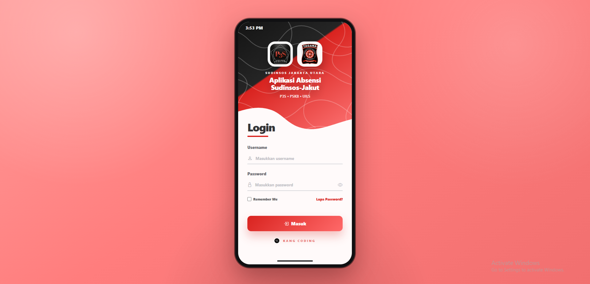
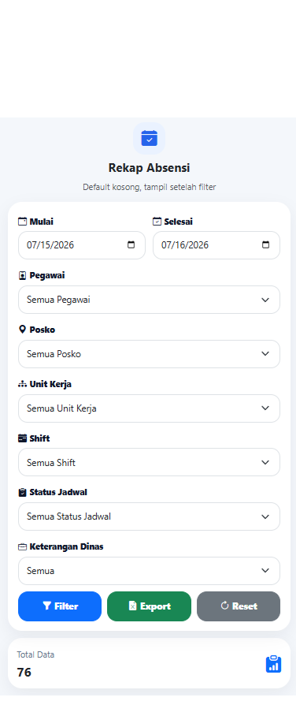
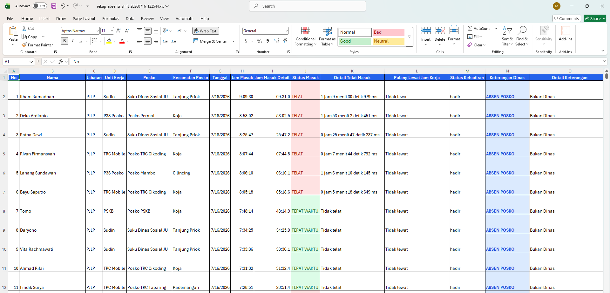

<div align="center">

# 📍 GPS Attendance Management System

### GPS Validation • Photo Verification • Shift Management • Leave • Field Activities • Reporting

A professional attendance and field-operations platform for monitoring employee presence, work locations, schedules, leave requests, and operational activities.

<p>
  
  
  
  
</p>

</div>

---

## 📌 Platform Overview

The GPS Attendance Management System centralizes employee attendance, GPS-based location validation, check-in/check-out photo verification, work-location management, shift scheduling, leave requests, field assignments, activity documentation, reporting, and audit logs.

This repository is a **privacy-safe professional portfolio showcase**. Faces displayed in attendance and activity evidence have been blurred before publication.

---

## ✨ Core Features

- GPS check-in and check-out
- Photo/selfie attendance verification
- Employee and account management
- Operational post/location management
- Shift and shift-pattern configuration
- Attendance history and monitoring
- Leave and permission workflows
- Field assignments and daily activities
- Report export
- System activity logs
- Responsive employee dashboard

---

## 🖼️ Application Preview


### Secure Login

<p align="center">
  
</p>

Role-protected authentication for administrators and employees.

---


## 📱 Mobile Application Gallery

Mobile screens are displayed at realistic phone dimensions for a cleaner portfolio presentation.


<table>
<tr>
<td align="center" width="50%"><strong>Administrator Dashboard</strong></td>
<td align="center" width="50%"><strong>User Data Form</strong></td>
</tr>
<tr>
<td align="center"></td>
<td align="center"></td>
</tr>
</table>

---


<table>
<tr>
<td align="center" width="50%"><strong>Employee Directory</strong></td>
<td align="center" width="50%"><strong>Post / Location Form</strong></td>
</tr>
<tr>
<td align="center"></td>
<td align="center"></td>
</tr>
</table>

---


<table>
<tr>
<td align="center" width="50%"><strong>Post Location List</strong></td>
<td align="center" width="50%"><strong>Post Location Detail</strong></td>
</tr>
<tr>
<td align="center"></td>
<td align="center"></td>
</tr>
</table>

---


<table>
<tr>
<td align="center" width="50%"><strong>Shift Configuration</strong></td>
<td align="center" width="50%"><strong>Shift Pattern Management</strong></td>
</tr>
<tr>
<td align="center"></td>
<td align="center"></td>
</tr>
</table>

---


<table>
<tr>
<td align="center" width="50%"><strong>GPS Attendance</strong></td>
<td align="center" width="50%"><strong>Attendance Monitoring</strong></td>
</tr>
<tr>
<td align="center"></td>
<td align="center"></td>
</tr>
</table>

---


<table>
<tr>
<td align="center" width="50%"><strong>Check-In Photo Verification</strong></td>
<td align="center" width="50%"><strong>GPS Map Verification</strong></td>
</tr>
<tr>
<td align="center"></td>
<td align="center"></td>
</tr>
</table>

---


<table>
<tr>
<td align="center" width="50%"><strong>Check-In & Check-Out Record</strong></td>
<td align="center" width="50%"><strong>Leave & Permission</strong></td>
</tr>
<tr>
<td align="center"></td>
<td align="center"></td>
</tr>
</table>

---


<table>
<tr>
<td align="center" width="50%"><strong>Leave Evidence</strong></td>
<td align="center" width="50%"><strong>Employee Activities</strong></td>
</tr>
<tr>
<td align="center"></td>
<td align="center"></td>
</tr>
</table>

---


<table>
<tr>
<td align="center" width="50%"><strong>Activity Documentation</strong></td>
<td align="center" width="50%"><strong>Field Assignment</strong></td>
</tr>
<tr>
<td align="center"></td>
<td align="center"></td>
</tr>
</table>

---


<table>
<tr>
<td align="center" width="50%"><strong>Field Activity Evidence</strong></td>
<td align="center" width="50%"><strong>System Activity Log</strong></td>
</tr>
<tr>
<td align="center"></td>
<td align="center"></td>
</tr>
</table>

---


<table>
<tr>
<td align="center" width="50%"><strong>Employee Dashboard</strong></td>
<td align="center" width="50%"><strong>Employee Dashboard — Mobile</strong></td>
</tr>
<tr>
<td align="center"></td>
<td align="center"></td>
</tr>
</table>

---


## 🖥️ Reports & Export

<p align="center">
  
</p>

Attendance and operational data export for administration and reporting.

---

## 🔄 Attendance Workflow

```text
Employee Login
      │
      ▼
Shift & Schedule Validation
      │
      ▼
GPS Location Validation
      │
      ├── Check-In Photo
      └── Check-Out Photo
      │
      ▼
Attendance Record
      │
      ├── Leave / Permission
      ├── Field Assignment
      └── Daily Activity
      │
      ▼
Admin Monitoring
      │
      ▼
Reports & Export
```

---

## 💻 Technology Stack

- PHP
- MySQL
- Bootstrap
- JavaScript
- HTML5
- CSS3
- Browser Geolocation API
- Responsive web interface

---

## 🔒 Security & Privacy

- Role-based authentication
- Session management
- GPS location validation
- Attendance evidence verification
- Server-side input validation
- Administrative activity logging
- Faces blurred in public portfolio screenshots

---

## ⚠️ Source Code Notice

This repository is intended for professional portfolio and product-showcase purposes only.

The complete source code is private because it contains proprietary business logic, implementation details, and environment-specific configurations.

---

## 👩‍💻 Developer

**Sari Larasati**

Senior Web Programmer & Freelance PHP Developer  
Enterprise Information Systems • Attendance Platforms • Operational Reporting

- GitHub: https://github.com/RASRASS18
- Email: laraskhalid@gmail.com
- Location: Mataram, West Nusa Tenggara, Indonesia

---

<div align="center">

### Reliable attendance. Verified locations. Better operational visibility.

</div>
